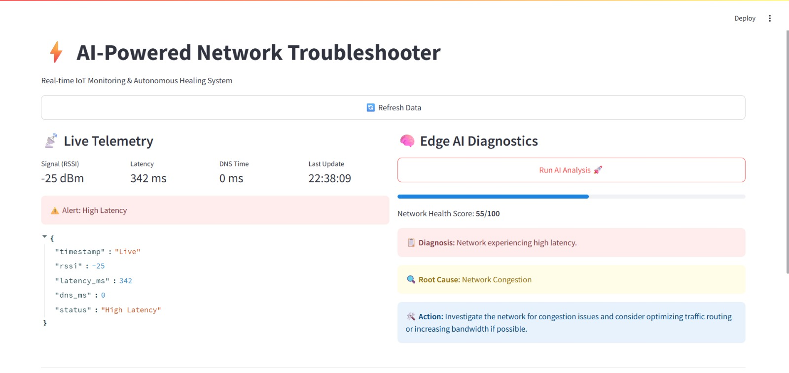
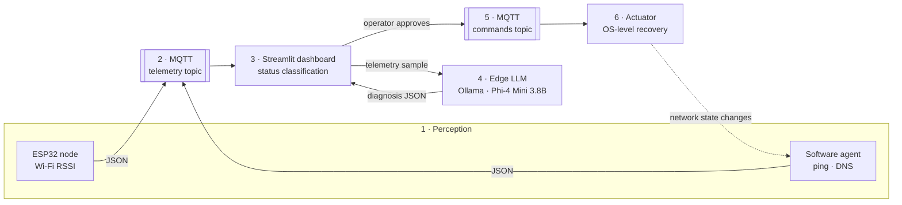
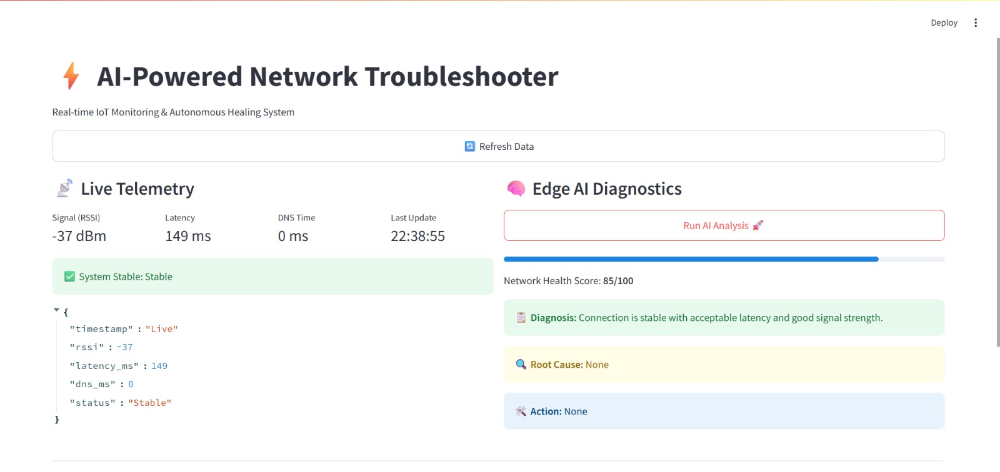
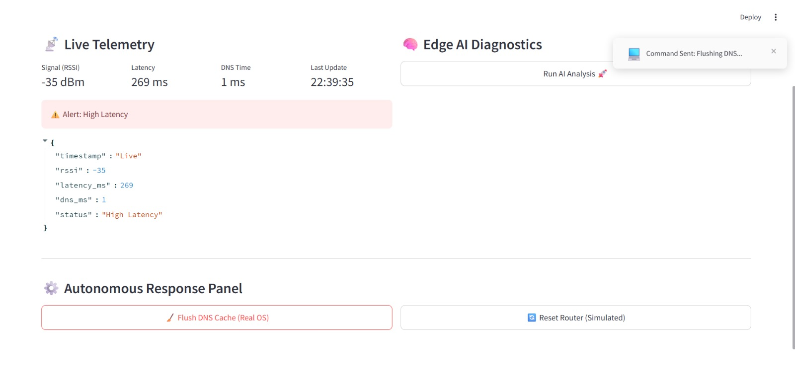
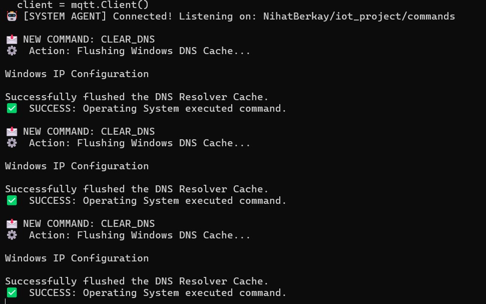
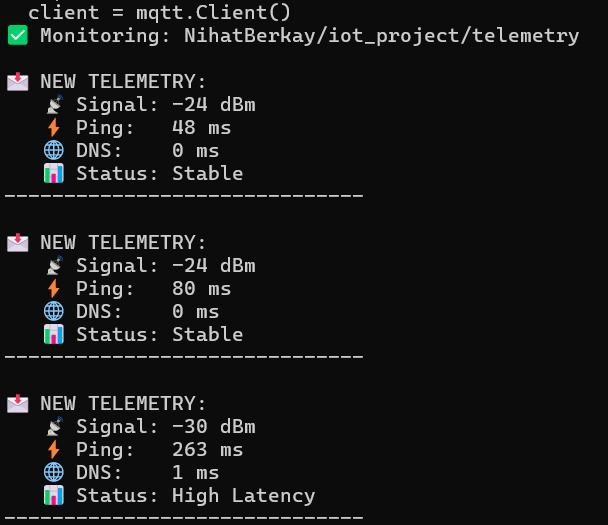

# Self-Healing AIoT Network Monitor & Edge LLM Agent

An end-to-end IoT pipeline that measures network health, explains *why* it degraded
using a quantised LLM running locally, and applies the recovery action once the
operator approves it.

[](https://www.python.org/)
[](https://mqtt.org/)
[](https://ollama.com/)
[](https://streamlit.io/)
[](https://www.espressif.com/)
[](LICENSE)



---

## Why

Slow pages, dropped connections and DNS stalls are constant, and the usual tools stop
at raw numbers. `-37 dBm` and `342 ms` are facts, not answers: they do not say whether
the problem is the radio, the uplink or the resolver, and they never suggest what to do
next. That gap is normally filled by someone who already knows the answer.

This project closes the loop. Telemetry is collected, classified, handed to a local
language model that reasons about the root cause, and turned into a concrete action the
dashboard can execute on the host machine — a full
**sense → transport → process → analyse → visualise → actuate** cycle.

Inference runs on-device through Ollama, so diagnosis works without an internet
connection or a third-party API, and telemetry is never uploaded for analysis.

## Architecture



| Level | Layer | Implementation | Responsibility |
|:-----:|-------|----------------|----------------|
| 1 | Perception | ESP32 + Python agent | RSSI, round-trip latency, DNS resolution time |
| 2 | Network | MQTT (ISO/IEC 20922) | Lightweight publish/subscribe transport |
| 3 | Processing | Python | Payload decoding, threshold-based status classification |
| 4 | Analytics | Ollama · Phi-4 Mini 3.8B | Root-cause reasoning, health score 0–100 |
| 5 | Application | Streamlit | Live metrics, diagnosis, operator controls |
| 6 | Actuation | OS commands over MQTT | DNS cache flush, router reset |

**Hybrid sensing.** The ESP32 provides real radio-level data; the Python agent runs on
the host and keeps the stream alive when the hardware is offline. Both publish an
identical schema, so nothing downstream cares which node produced a sample.

**Semi-automatic by design.** A 3.8B model can hallucinate, so the actuation layer is
never triggered by the model directly. The LLM recommends, the operator confirms, and
only allow-listed commands are executed.

## Repository layout

```
├── src/
│   ├── app.py               Streamlit dashboard, MQTT subscriber, control panel
│   ├── ai_engine.py         Ollama prompt, JSON extraction, output validation
│   ├── network_monitor.py   Software sensing agent + status classification
│   ├── actuator.py          Command subscriber, allow-listed OS actions
│   ├── mqtt_listener.py     Terminal telemetry monitor for debugging
│   └── config.py            Single source of truth, env-var overridable
├── firmware/
│   └── esp32_telemetry/     Arduino sketch for the hardware node
├── docs/
│   └── images/              Dashboard and runtime screenshots
├── .env.example
└── requirements.txt
```

## Getting started

### Prerequisites

- Python 3.10 or newer
- [Ollama](https://ollama.com/download) running locally
- Optional: an ESP32 dev board — the pipeline runs fine without it

### Install

```bash
git clone https://github.com/yberkayinci/self-healing-aiot-network-monitor-edge-llm-agent.git
cd self-healing-aiot-network-monitor-edge-llm-agent
python -m venv .venv
```

Activate the environment (`.venv\Scripts\activate` on Windows,
`source .venv/bin/activate` on macOS and Linux), then:

```bash
pip install -r requirements.txt
ollama pull phi4-mini:3.8b
```

### Configure

```bash
cp .env.example .env
```

The defaults point at the public broker `test.mosquitto.org`. **Change
`MQTT_TOPIC_PREFIX` to something of your own** — the public broker is shared, so
anyone can read or write the default topics.

### Run

Three processes, one terminal each:

```bash
python src/network_monitor.py
```

```bash
python src/actuator.py
```

```bash
streamlit run src/app.py
```

The dashboard comes up on `http://localhost:8501`. Flash
`firmware/esp32_telemetry` if you have the board — see
[firmware/README.md](firmware/README.md). To watch the raw stream instead of the
dashboard, run `python src/mqtt_listener.py`.

## Configuration

Every value is read from the environment with a fallback in [`src/config.py`](src/config.py).

| Variable | Default | Purpose |
|----------|---------|---------|
| `MQTT_BROKER` / `MQTT_PORT` | `test.mosquitto.org` / `1883` | Broker endpoint |
| `MQTT_TOPIC_PREFIX` | `yberkayinci/aiot-monitor` | Prefix for the `/telemetry` and `/commands` topics |
| `OLLAMA_MODEL` | `phi4-mini:3.8b` | Local model used for diagnosis |
| `OLLAMA_HOST` | unset | Point at a remote Ollama instance |
| `PING_TARGET` / `DNS_TARGET` | `8.8.8.8` / `www.google.com` | Sensing targets |
| `POLL_INTERVAL` | `2` | Seconds between telemetry samples |
| `LATENCY_WARN_MS` | `150` | Latency threshold for *High Latency* |
| `DNS_WARN_MS` | `500` | DNS threshold for *DNS Timeout* |

## Data contracts

Telemetry published by either sensing node:

```json
{
  "timestamp": "2025-12-18T22:38:09",
  "source": "esp32",
  "rssi": -37,
  "latency_ms": 149,
  "dns_ms": 0,
  "status": "Stable"
}
```

Diagnosis returned by the LLM, validated and clamped before it reaches the UI:

```json
{
  "summary": "Network experiencing high latency.",
  "root_cause": "Network congestion on the uplink path.",
  "recommendation": "Investigate congestion and consider optimising traffic routing.",
  "health_score": 55
}
```

Status classification, applied before the model ever sees the sample:

| Condition | Status | Severity |
|-----------|--------|----------|
| `latency_ms == -1` | `Disconnected` | Critical |
| `latency_ms > 150` | `High Latency` | Warning |
| `dns_ms > 500` | `DNS Timeout` | Warning |
| otherwise | `Stable` | OK |

Actuation commands, both allow-listed in `config.SUPPORTED_COMMANDS`:

| Command | Effect | Type |
|---------|--------|------|
| `CLEAR_DNS` | Flushes the OS DNS resolver cache — `ipconfig /flushdns`, `dscacheutil`, `resolvectl` | Real |
| `RESET_SIMULATION` | Router reboot sequence | Simulated |

Anything else arriving on the command topic is logged and dropped.

## Screenshots

| Stable network | High latency detected |
|:--:|:--:|
|  |  |

Operator-approved recovery, and the actuator executing it on the host:



| Actuator agent | Telemetry monitor |
|:--:|:--:|
|  |  |

## Design decisions

| Decision | Why | Trade-off |
|----------|-----|-----------|
| Local LLM instead of a hosted API | Privacy, no API cost, works offline | Needs local compute; a 3.8B model reasons more coarsely |
| Operator approval before actuation | A hallucinated diagnosis cannot change the system | Slower recovery, needs a human in the loop |
| Hybrid sensing: hardware + host agent | Real radio metrics plus an always-available fallback | Two sources to reconcile |
| Public MQTT broker | Zero setup, easy to demo | Not production-safe; topics are world-readable |
| Threshold classification before the model | Cheap, deterministic severity for the UI | Thresholds are static and need retuning per network |

## Roadmap

- Time-series storage for historical queries and trend-based prediction
- Environmental sensors — temperature, humidity — correlated against network quality
- Larger local models, benchmarked against the 3.8B diagnosis baseline
- Raspberry Pi deployment so the whole pipeline runs on the edge
- Multi-node monitoring with an aggregate dashboard
- SNMP actuation for real router and bandwidth control

## Author

**Yunus Berkay İnci** — [@yberkayinci](https://github.com/yberkayinci)

Built as the final project for **SENG423 — Internet of Things**.

## License

[MIT](LICENSE)
